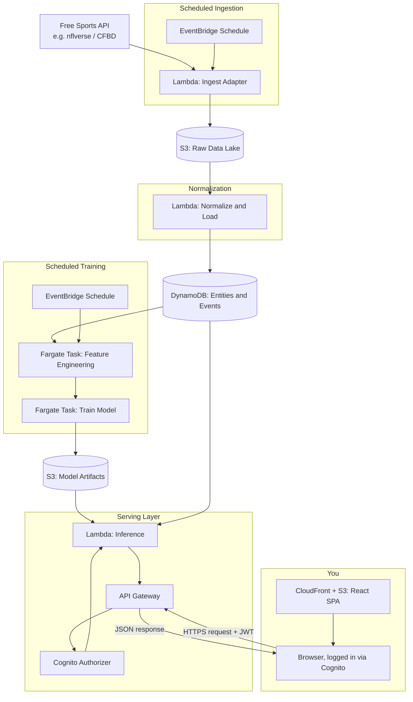
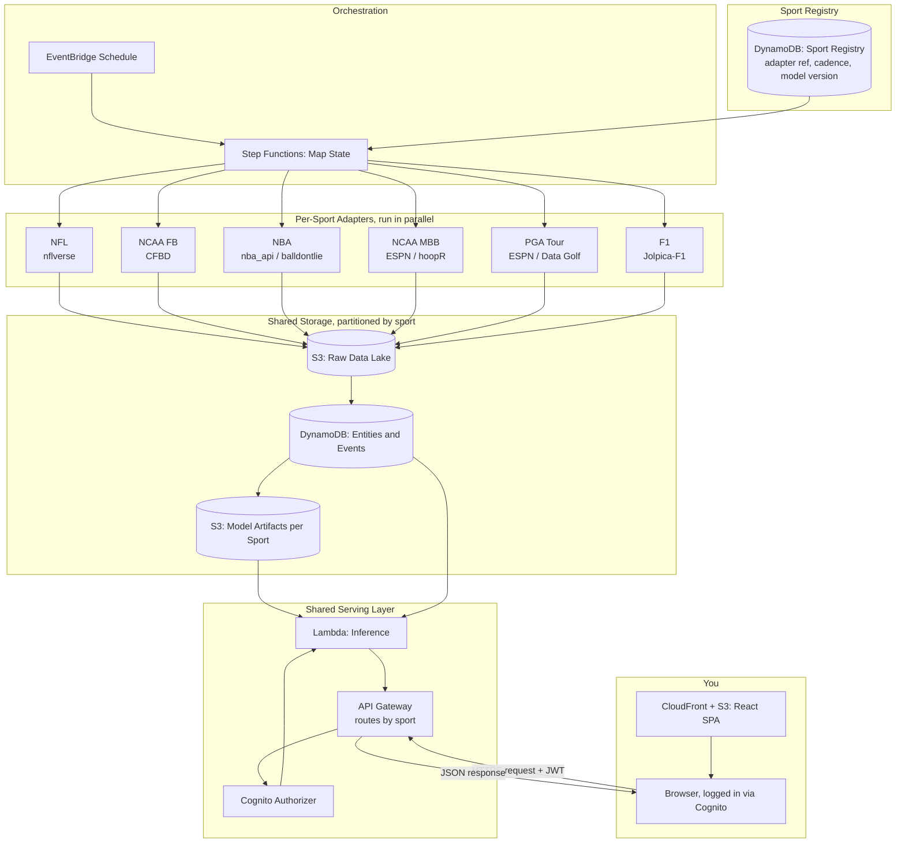

# Architecture

This document describes the system architecture in two stages: the single-sport pipeline you build first (Phase 1 of `PROJECT_PLAN.md`), and the multi-sport, registry-driven version it evolves into (Phase 4 onward). Both diagrams render natively in GitHub and in most Markdown viewers.

## Single-sport architecture

This is what you're building for NFL first, and it's the template every other head-to-head sport (NCAA FB, NBA, NCAA MBB) follows without modification to the shared layers.

**Why these specific pieces:** every compute component is either event-triggered (Lambda) or runs only on a schedule and exits (Fargate task) — nothing is billed while idle. S3 holds anything large or rarely queried directly (raw pulls, model artifacts); DynamoDB holds anything the inference Lambda needs to read quickly by key. There's no SageMaker endpoint, no RDS instance, no NAT Gateway — each of those would add a meaningful fixed monthly cost for a benefit this project doesn't need yet.

## Multi-sport architecture

This is the target state once Phase 4 is complete: a sport registry and a single orchestration layer fan out to per-sport adapters, all converging on the same shared storage and serving layers. Onboarding sport #7 means adding one adapter and one registry row — nothing else on this diagram changes.

**What changed from the single-sport version:** EventBridge no longer triggers one ingest Lambda directly — it triggers a Step Functions Map state that reads the sport registry and fans out to whichever adapters are due to run. Storage and serving stay exactly the same shape, just partitioned by a `sport` key so six sports' data coexists in the same tables without colliding.

## Access control

The frontend sits at a public URL by design (so you can reach it from anywhere), but every API call requires authentication — there is no anonymous access path.

**Cognito User Pool.** One user pool, one app client, self-signup disabled. You create your own user manually (via the AWS console or CLI) rather than exposing a public registration flow. This means the only way to obtain a valid token is to already have credentials you created yourself.

**API Gateway Cognito authorizer.** API Gateway has a built-in integration for validating Cognito-issued JWTs on every request — no custom Lambda authorizer needed. Requests without a valid, unexpired token are rejected at the gateway, before they ever reach the inference Lambda.

**CloudFront + S3 for the SPA.** The React app itself is static and technically loads for anyone who hits the URL, but it's useless without logging in — every data call it makes requires the Cognito token, so an unauthenticated visitor sees a login screen and nothing else.

**Usage plan as a second layer.** Attach a low-throughput usage plan (e.g., a handful of requests per second) to the API Gateway stage regardless of authentication. Since you're the only legitimate caller, any traffic pattern that would hit this limit is almost certainly not you — it's a cheap tripwire against scraping or abuse even if a token were ever compromised.

**What this deliberately avoids:** no WAF, no custom Lambda authorizer, no API keys distributed to anyone. For a single-user project, Cognito plus a usage plan covers the realistic threat model (random internet traffic finding the URL) without adding services that mainly matter at multi-tenant scale.
