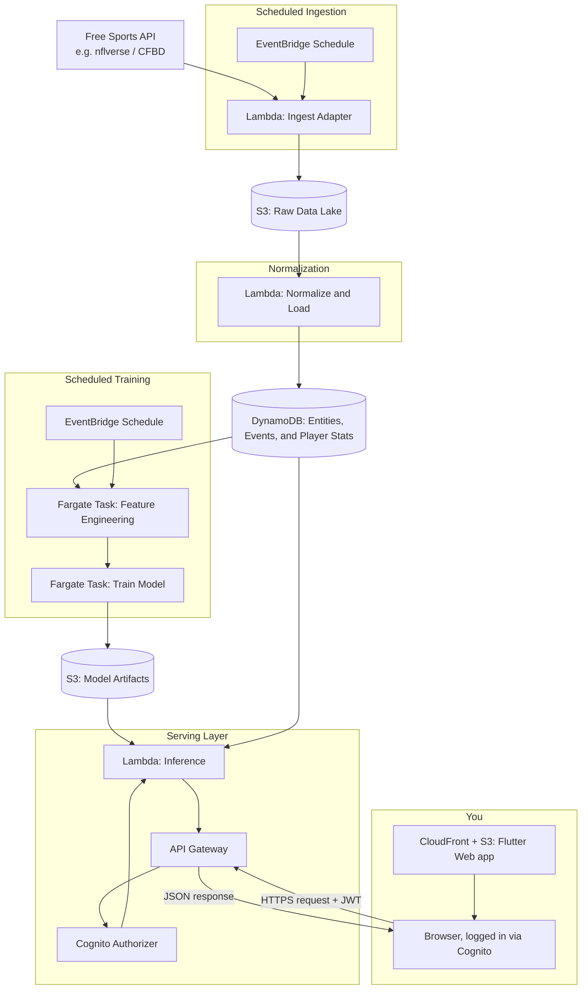
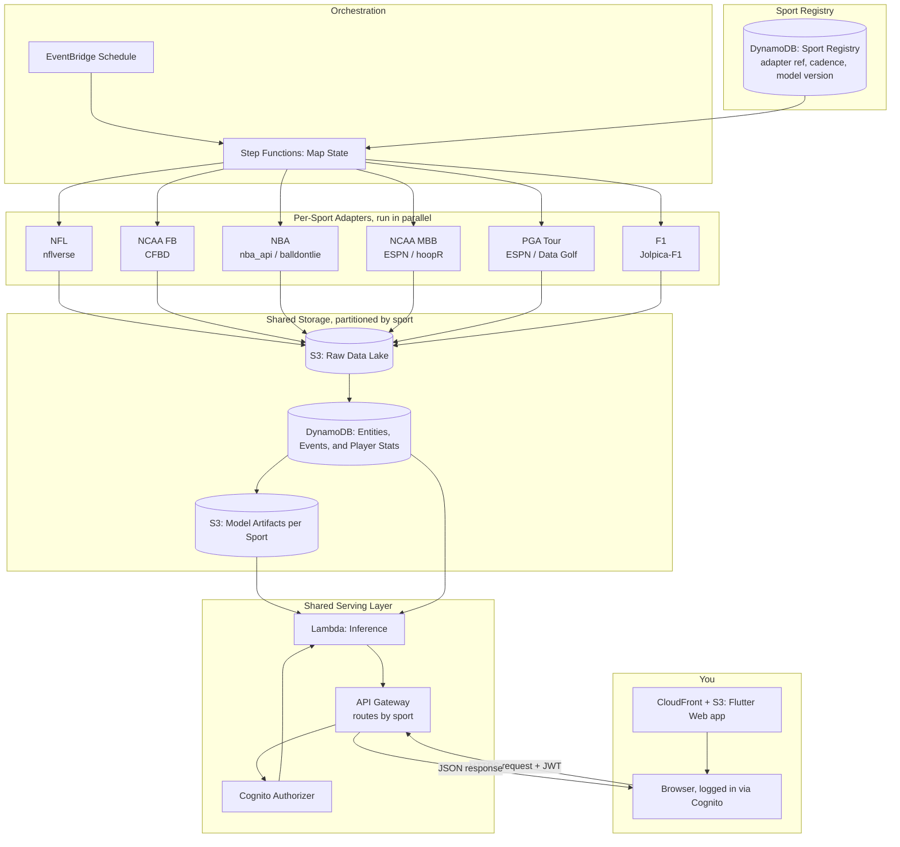

# Architecture

This document describes the system architecture in two stages: the single-sport pipeline you build first (Phase 1 of `PROJECT_PLAN.md`), and the multi-sport, registry-driven version it evolves into (Phase 4 onward). Both diagrams render natively in GitHub and in most Markdown viewers.

## Single-sport architecture

This is what you're building for NFL first, and it's the template every other head-to-head sport (NCAA FB, NBA, NCAA MBB) follows without modification to the shared layers.

```mermaid
flowchart TD
    subgraph Ingest["Scheduled Ingestion"]
        SCH1["EventBridge Schedule"]
        ING["Lambda: Ingest Adapter"]
    end

    SRC["Free Sports API<br/>e.g. nflverse / CFBD"] --> ING
    SCH1 --> ING
    ING --> RAW[("S3: Raw Data Lake")]

    subgraph Normalize["Normalization"]
        NORM["Lambda: Normalize and Load"]
    end
    RAW --> NORM --> DDB[("DynamoDB: Entities, Events, and Player Stats")]

    subgraph Train["Scheduled Training"]
        SCH2["EventBridge Schedule"]
        FEAT["Fargate Task: Feature Engineering"]
        MODEL["Fargate Task: Train Model"]
    end
    DDB --> FEAT
    SCH2 --> FEAT
    FEAT --> MODEL --> ARTIFACT[("S3: Model Artifacts")]

    subgraph Serve["Serving Layer"]
        APIGW["API Gateway"]
        AUTH["Cognito Authorizer"]
        INF["Lambda: Inference"]
    end
    ARTIFACT --> INF
    DDB --> INF
    APIGW --> AUTH
    AUTH --> INF
    INF --> APIGW

    subgraph Client["You"]
        CF["CloudFront + S3: Flutter Web app"]
        BROWSER["Browser, logged in via Cognito"]
    end
    CF --> BROWSER
    BROWSER -->|"HTTPS request + JWT"| APIGW
    APIGW -->|"JSON response"| BROWSER
```

**Why these specific pieces:** every compute component is either event-triggered (Lambda) or runs only on a schedule and exits (Fargate task) — nothing is billed while idle. S3 holds anything large or rarely queried directly (raw pulls, model artifacts); DynamoDB holds anything the inference Lambda needs to read quickly by key. There's no SageMaker endpoint, no RDS instance, no NAT Gateway — each of those would add a meaningful fixed monthly cost for a benefit this project doesn't need yet.

## Multi-sport architecture

The orchestration half of this (sport registry + Step Functions Map states) is live as of Phase 4, ahead of the original Phase 2/3 sequencing — see `design/PROJECT_PLAN.md`'s Phase 4 note on why. Only NFL is actually registered today; the diagram below shows where NCAA FB/NBA/NCAA MBB/PGA/F1 land once their own adapters exist, not a built state.

There are two orchestrator state machines, not one, split by how differently ingest and training actually need to run: `Terraform/sfn-ingest-orchestrator.tf` fans out to each active sport's ingest Lambda once daily, and `Terraform/sfn-training-orchestrator.tf` fans out to each active sport's feature-engineering task and then, per sport, an inner Map over that sport's own `training_targets` list (win-probability, score, and every player-prop model) once weekly — collapsing what used to be up to a dozen separate EventBridge Scheduler resources and hand-picked cron time slots per sport into two schedules total, regardless of how many sports or training targets exist. Both read the same sport registry table; onboarding a new sport means deploying its own Lambdas/ECS task definitions under the existing `<project>-<sport>-<stage>` naming convention and adding one registry row — nothing on this diagram or in either state machine's definition changes.

```mermaid
flowchart TD
    subgraph Registry["Sport Registry"]
        REG[("DynamoDB: Sport Registry<br/>adapter ref, cadence, model version")]
    end

    subgraph Orchestration["Orchestration"]
        EB["EventBridge Schedule"]
        SFN["Step Functions: Map State"]
    end
    EB --> SFN
    REG --> SFN

    subgraph Adapters["Per-Sport Adapters, run in parallel"]
        direction LR
        A1["NFL<br/>nflverse"]
        A2["NCAA FB<br/>CFBD"]
        A3["NBA<br/>nba_api / balldontlie"]
        A4["NCAA MBB<br/>ESPN / hoopR"]
        A5["PGA Tour<br/>ESPN / Data Golf"]
        A6["F1<br/>Jolpica-F1"]
    end
    SFN --> A1
    SFN --> A2
    SFN --> A3
    SFN --> A4
    SFN --> A5
    SFN --> A6

    subgraph Storage["Shared Storage, partitioned by sport"]
        RAW[("S3: Raw Data Lake")]
        DDB[("DynamoDB: Entities, Events, and Player Stats")]
        ARTIFACT[("S3: Model Artifacts per Sport")]
    end
    A1 --> RAW
    A2 --> RAW
    A3 --> RAW
    A4 --> RAW
    A5 --> RAW
    A6 --> RAW
    RAW --> DDB
    DDB --> ARTIFACT

    subgraph Serve["Shared Serving Layer"]
        APIGW["API Gateway<br/>routes by sport"]
        AUTH["Cognito Authorizer"]
        INF["Lambda: Inference"]
    end
    ARTIFACT --> INF
    DDB --> INF
    APIGW --> AUTH
    AUTH --> INF
    INF --> APIGW

    subgraph Client["You"]
        CF["CloudFront + S3: Flutter Web app"]
        BROWSER["Browser, logged in via Cognito"]
    end
    CF --> BROWSER
    BROWSER -->|"HTTPS request + JWT"| APIGW
    APIGW -->|"JSON response"| BROWSER
```

**What changed from the single-sport version:** EventBridge no longer triggers ingest/training Lambdas and Fargate tasks directly — it starts one of the two state machines above, which reads the sport registry and fans out to whichever sports are active (see the registry's `active` flag in `design/DATA_SCHEMA.md`, which also replaced the old NFL-only Aug-Feb cron window as the season on/off switch). Storage and serving stay exactly the same shape, just partitioned by a `sport` key so six sports' data coexists in the same tables without colliding.

## Access control

The frontend sits at a public URL by design (so you can reach it from anywhere), but every API call requires authentication — there is no anonymous access path.

**Cognito User Pool.** One user pool, one app client, self-signup disabled. You create your own user manually (via the AWS console or CLI) rather than exposing a public registration flow. This means the only way to obtain a valid token is to already have credentials you created yourself.

**API Gateway Cognito authorizer.** API Gateway has a built-in integration for validating Cognito-issued JWTs on every request — no custom Lambda authorizer needed. Requests without a valid, unexpired token are rejected at the gateway, before they ever reach the inference Lambda.

**CloudFront + S3 for the Flutter Web app.** The compiled Flutter app is static and technically loads for anyone who hits the URL, but it's useless without logging in — every data call it makes requires the Cognito token, so an unauthenticated visitor sees a login screen and nothing else.

**Usage plan as a second layer.** Attach a low-throughput usage plan (e.g., a handful of requests per second) to the API Gateway stage regardless of authentication. Since you're the only legitimate caller, any traffic pattern that would hit this limit is almost certainly not you — it's a cheap tripwire against scraping or abuse even if a token were ever compromised.

**What this deliberately avoids:** no WAF, no custom Lambda authorizer, no API keys distributed to anyone. For a single-user project, Cognito plus a usage plan covers the realistic threat model (random internet traffic finding the URL) without adding services that mainly matter at multi-tenant scale.
