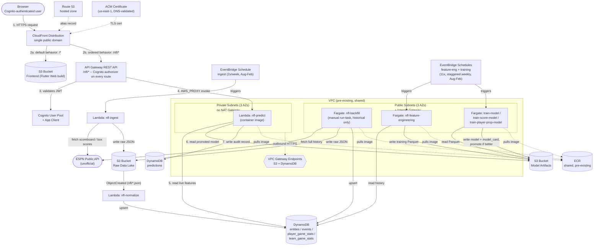

# AWS Architecture (current, NFL/Phase 1)

This documents the AWS architecture actually deployed today, as built rather than as originally planned (compare `design/ARCHITECTURE.md`, which is the earlier single-sport/multi-sport target-state design). The diagram source lives at `design/AWS_ARCHITECTURE.mmd` and is also embedded below — GitHub and most Markdown viewers render Mermaid natively, so the two stay in sync as one file.

## Diagram

**Reading the arrows:** solid arrows are data flow or invocation -- the thing that actually happens on a request or a scheduled run. Dotted arrows are supporting dependencies that aren't data flow (a TLS cert backing a distribution, a container image pull, the VPC path to the Gateway Endpoints). The client request path is numbered 1-7 in arrow order since it's the one path worth tracing end-to-end; everything else is labeled with the verb describing what crosses that arrow, since those paths run independently of each other on their own schedules.

## Client request path (numbered 1-7 above)

1. Browser sends an HTTPS request to the app's one public domain (Route 53 alias → CloudFront; ACM cert issued in `us-east-1` specifically, since CloudFront requires that regardless of the stack's primary region).
2. CloudFront routes by path: the default behavior (`/*`) serves the Flutter web build from the frontend S3 bucket; an ordered behavior (`/nfl/*`) forwards instead to API Gateway's `execute-api` origin. This is why frontend and API share one origin and production traffic never triggers a browser CORS check.
3. API Gateway validates the request's JWT against the Cognito User Pool via a built-in `COGNITO_USER_POOLS` authorizer -- a local signature/claims check against cached JWKS keys, not a network call to Cognito on every request (and API Gateway caches the result per-token for 5 minutes on top of that).
4. API Gateway invokes the `nfl-predict` Lambda (`AWS_PROXY` integration -- the Lambda gets the raw request and returns the raw response, no request/response mapping templates).
5. The Lambda reads whatever live feature context it needs (event/entity/player/team history) from DynamoDB.
6. It reads the currently-promoted model artifact(s) it needs from the model-artifacts S3 bucket.
7. It writes an audit record of the prediction it just made to the `predictions` table (write-only from this Lambda's perspective -- it never reads a past prediction back).

`nfl-predict` is the one Lambda in this whole architecture reachable from outside the account, so it's VPC-attached (private subnets, no public IP) as a defense-in-depth boundary, reaching DynamoDB and S3 only through the VPC's Gateway Endpoints -- no NAT Gateway needed, which is what keeps this whole architecture within a personal-scale budget (a NAT Gateway alone runs roughly $32/month before any data transfer).

## Scheduled ingestion

An EventBridge schedule fires the `nfl-ingest` Lambda twice a week (a primary run plus a next-day retry for anything ESPN hadn't finalized yet), only during the season (Aug-Feb). It fetches that week's scoreboard and any newly-completed box scores from ESPN and writes raw JSON to the raw-data-lake S3 bucket -- and nothing else; it never touches DynamoDB directly. Every `PutObject` under the `nfl/` prefix triggers the `nfl-normalize` Lambda via an S3 event notification, which maps the raw ESPN JSON into the project's schema and upserts it into the `entities`, `events`, and `player_game_stats` tables.

## One-time historical backfill

`nfl-backfill` is a standalone Fargate task (`aws ecs run-task`, not a long-running service) that pulls the full 2016-2025 history in one pass -- team data, every game, every player's box score -- writing the same raw-JSON-to-S3 and upsert-to-DynamoDB pattern ingest uses, just for the whole history instead of one week. It runs in a public subnet with a public IP (not the private/Gateway-Endpoint path) because it needs to reach ESPN's public API directly, and a NAT Gateway to give a private subnet that same reach would cost more than this project's monthly budget. Safe to re-run at any time -- every write is an upsert, and a box score fetch is skipped if it's already in S3.

## Scheduled training

Two more EventBridge-driven Fargate pipelines, both Aug-Feb, both standalone run-to-completion tasks sharing the same public-subnet path backfill uses (simpler and free, versus paying for ECR VPC Interface Endpoints to run these privately):

- **Feature engineering**: reads the full `events`/`player_game_stats`/`team_game_stats` history from DynamoDB and writes two training Parquet files to the model-artifacts bucket.
- **Training** (11 separate scheduled tasks, staggered 15 minutes apart to stay under the account's Fargate vCPU quota): win-probability, one per score target (margin/home-score/away-score), and one per player-prop stat (7 stats) -- each reads the Parquet dataset, trains, and writes a versioned model artifact plus a model card back to the model-artifacts bucket, promoting the new version to "current" unless it's a meaningful regression against whatever's already promoted.

## Storage

| Store | Holds |
|---|---|
| S3: Raw Data Lake | Every raw ESPN API response, exactly as received, forever (this is the layer that lets normalization/feature logic be re-run or fixed later without re-fetching from ESPN) |
| S3: Model Artifacts | Versioned model binaries, model cards, and the training Parquet datasets |
| S3: Frontend | The built Flutter web app, served by CloudFront |
| DynamoDB: entities / events / player_game_stats / team_game_stats | The normalized schema every sport adapter writes to and every serving/training job reads from |
| DynamoDB: predictions | Audit log of every prediction ever served, write-only from `nfl-predict`'s perspective |
| DynamoDB: sport_registry | Empty today -- reserved for the Phase 4 multi-sport registry (`design/ARCHITECTURE.md`), created now since an empty on-demand table costs nothing |

## External dependencies

- **ESPN's public API** is unofficial and undocumented -- every adapter (ingest, backfill) treats it as a data source only, never assumes a documented contract will hold across seasons.
- **ECR** is pre-existing and shared across projects outside this Terraform stack (referenced via `var.ecr_repo_url`, not managed here) -- every container image (the `nfl-predict` Lambda and every Fargate task) pulls from it.

## Not shown on the diagram

**Cost controls** (`Terraform/budgets.tf`) -- an AWS Budgets alert scoped to this project's cost-allocation tags, emailing at 80%/100% actual spend and 100% forecasted spend, plus optional per-sport budgets. Left off the diagram deliberately: it observes account-wide spend passively rather than participating in any request or data flow, so drawing an arrow for it would only add clutter without describing a real interaction.

**IAM roles** -- every compute resource above runs under its own least-privilege role (`lambda_pipeline` for ingest/normalize, `lambda_inference` for predict, `nfl_backfill`, `ecs_pipeline` shared by feature-engineering and training, `eventbridge_invoke` for the schedules themselves) rather than one shared role. Not drawn as nodes since IAM is a cross-cutting permissions concern, not a data-flow hop -- see the `iam-*.tf` files for the exact policy each role carries.
