# AWS Architecture (current, NFL/Phase 1)

This documents the AWS architecture actually deployed today, as built rather than as originally planned (compare `design/ARCHITECTURE.md`, which is the earlier single-sport/multi-sport target-state design).

Two diagrams, one per independent flow (client request path; the scheduled data pipeline) — splitting them was deliberate, not incidental: a single diagram covering both got dense enough (~30 edges converging on a handful of shared storage nodes) that labels and arrowheads started overlapping. Each diagram's `.mmd` source under `design/` is the single source of truth for that diagram; the SVGs embedded below are generated from it, never hand-duplicated, so there's exactly one place to edit either one. **[Open both in a larger, pannable view →](https://claude.ai/code/artifact/f9292759-553b-4215-8a1c-bbff1782c71a)**

Regenerate an SVG after editing its source (from the repo root):
```
npx @mermaid-js/mermaid-cli -i design/AWS_ARCHITECTURE.mmd -o docs/images/aws_architecture_client.svg -b white
npx @mermaid-js/mermaid-cli -i design/AWS_ARCHITECTURE_PIPELINE.mmd -o docs/images/aws_architecture_pipeline.svg -b white
```
`mermaid-cli` drives a local headless Chromium via Puppeteer — if that fails to launch (`Invalid file descriptor to ICU data received` is a known Windows-specific Puppeteer bug, confirmed on this machine 2026-08-22, unrelated to the diagram source itself), render server-side via [mermaid.ink](https://mermaid.ink) instead, which needs no local browser (swap the filename for the client diagram as needed):
```
curl -sS "https://mermaid.ink/svg/$(node -e "process.stdout.write(Buffer.from(require('fs').readFileSync('design/AWS_ARCHITECTURE_PIPELINE.mmd','utf8')).toString('base64url'))")?bgColor=white" -o docs/images/aws_architecture_pipeline.svg
```

**Reading either diagram:** solid arrows are data flow or invocation; dotted arrows are supporting dependencies that aren't data flow (a TLS cert backing a distribution, a container image pull, the VPC path to the Gateway Endpoints). Color is component role, not decoration, and means the same thing in both diagrams: orange is the two serving Lambdas API Gateway invokes directly, yellow is the recurring ingest pipeline, green is Fargate (backfill/training), red is storage, purple is the API/auth layer, blue is the CDN/DNS edge, gray-dashed is EventBridge scheduling, and flat gray is anything external to (or shared outside) this stack.

## Diagram: client request path

Source: [`design/AWS_ARCHITECTURE.mmd`](../design/AWS_ARCHITECTURE.mmd)



Arrows are numbered 1-7 in request order -- it's the one path worth tracing end-to-end, unlike the pipeline diagram below where each flow runs independently on its own schedule.

## Client request path (numbered 1-7 above)

1. Browser sends an HTTPS request to the app's one public domain (Route 53 alias → CloudFront; ACM cert issued in `us-east-1` specifically, since CloudFront requires that regardless of the stack's primary region).
2. CloudFront routes by path: the default behavior (`/*`) serves the Flutter web build from the frontend S3 bucket; an ordered behavior (`/nfl/*`) forwards instead to API Gateway's `execute-api` origin. This is why frontend and API share one origin and production traffic never triggers a browser CORS check.
3. API Gateway validates the request's JWT against the Cognito User Pool via a built-in `COGNITO_USER_POOLS` authorizer -- a local signature/claims check against cached JWKS keys, not a network call to Cognito on every request (and API Gateway caches the result per-token for 5 minutes on top of that).
4. API Gateway invokes one of two Lambdas depending on the route (`AWS_PROXY` integration either way -- the Lambda gets the raw request and returns the raw response, no request/response mapping templates):
   - **`nfl-predict-read`** for `GET /nfl/events` and `GET /nfl/models` -- split out from `nfl-predict` specifically for cold start. Neither route ever loads or deserializes an ML model artifact (events reads already-logged predictions back for the predicted-vs-actual comparison; models only reads a model card's JSON metadata), so this Lambda needs nothing beyond boto3 -- no xgboost/scikit-learn/pandas, and zip-packaged rather than a container image as a result. Confirmed live via CloudWatch that `nfl-predict`'s cold start was repeatedly hitting Lambda's own non-configurable 10-second init-phase ceiling; these two routes are also this API's most frequently hit traffic (every page load), so they're the ones that benefited most from not paying that cost.
   - **`nfl-predict`** for everything that actually needs a model: `GET /nfl/season` and both `GET /nfl/predictions/*` routes.
5. The invoked Lambda reads whatever context it needs from DynamoDB (live feature history for `nfl-predict`; events + already-logged predictions for `nfl-predict-read`) and, if it's `nfl-predict`, the currently-promoted model artifact(s) it needs from the model-artifacts S3 bucket (`nfl-predict-read` only ever reads a model card's JSON metadata, never an artifact itself).
6. `nfl-predict` deserializes and scores the model.
7. `nfl-predict` writes an audit record of the prediction it just made to the `predictions` table (write-only from its perspective -- it never reads a past prediction back; `nfl-predict-read` is the one that reads that table, for the predicted-vs-actual comparison on completed events).

Both `nfl-predict` and `nfl-predict-read` are reachable from outside the account, so both are VPC-attached (private subnets, no public IP) as a defense-in-depth boundary, reaching DynamoDB and S3 only through the VPC's Gateway Endpoints -- no NAT Gateway needed, which is what keeps this whole architecture within a personal-scale budget (a NAT Gateway alone runs roughly $32/month before any data transfer). Splitting the Lambda didn't change this part of the design -- both still need the same VPC path to the same endpoints, since the split is about import-time cost, not network path.

## Diagram: scheduled data pipeline

Source: [`design/AWS_ARCHITECTURE_PIPELINE.mmd`](../design/AWS_ARCHITECTURE_PIPELINE.mmd)



## Scheduled ingestion

An EventBridge schedule fires the `nfl-ingest` Lambda twice a week (a primary run plus a next-day retry for anything ESPN hadn't finalized yet), only during the season (Aug-Feb). It fetches that week's scoreboard and any newly-completed box scores from ESPN and writes raw JSON to the raw-data-lake S3 bucket -- and nothing else; it never touches DynamoDB directly. Every `PutObject` under the `nfl/` prefix triggers the `nfl-normalize` Lambda via an S3 event notification, which maps the raw ESPN JSON into the project's schema and upserts it into the `entities`, `events`, and `player_game_stats` tables.

## One-time historical backfill

`nfl-backfill` is a standalone Fargate task (`aws ecs run-task`, not a long-running service) that pulls the full 2016-2025 history in one pass -- team data, every game, every player's box score -- writing the same raw-JSON-to-S3 and upsert-to-DynamoDB pattern ingest uses, just for the whole history instead of one week. It runs in a public subnet with a public IP (not the private/Gateway-Endpoint path) because it needs to reach ESPN's public API directly, and a NAT Gateway to give a private subnet that same reach would cost more than this project's monthly budget. Safe to re-run at any time -- every write is an upsert, and a box score fetch is skipped if it's already in S3.

## Scheduled training

Two more EventBridge-driven Fargate pipelines, both Aug-Feb, both standalone run-to-completion tasks sharing the same public-subnet path backfill uses (simpler and free, versus paying for ECR VPC Interface Endpoints to run these privately):

- **Feature engineering**: reads the full `events`/`player_game_stats`/`team_game_stats` history from DynamoDB and writes two training Parquet files to the model-artifacts bucket.
- **Training** (11 separate scheduled tasks, staggered 30 minutes apart to stay under the account's Fargate vCPU quota -- widened from an original 15 minutes once every target started running a multi-algorithm tournament instead of fitting one model): win-probability, one per score target (margin/home-score/away-score), and one per player-prop stat (7 stats) -- each reads the Parquet dataset, runs every candidate algorithm for that target through the shared backtesting harness (`library/ml/backtest.py`), and writes a versioned model artifact plus a model card per candidate back to the model-artifacts bucket, promoting whichever one wins unless it's a meaningful regression against whatever's already promoted.

## Storage

| Store | Holds |
|---|---|
| S3: Raw Data Lake | Every raw ESPN API response, exactly as received, forever (this is the layer that lets normalization/feature logic be re-run or fixed later without re-fetching from ESPN) |
| S3: Model Artifacts | Versioned model binaries, model cards, and the training Parquet datasets |
| S3: Frontend | The built Flutter web app, served by CloudFront |
| DynamoDB: entities / events / player_game_stats / team_game_stats | The normalized schema every sport adapter writes to and every serving/training job reads from |
| DynamoDB: predictions | Audit log of every prediction ever served, write-only from `nfl-predict`'s perspective |
| DynamoDB: sport_registry | Empty today -- reserved for the Phase 4 multi-sport registry (`design/ARCHITECTURE.md`), created now since an empty on-demand table costs nothing |

## External dependencies

- **ESPN's public API** is unofficial and undocumented -- every adapter (ingest, backfill) treats it as a data source only, never assumes a documented contract will hold across seasons.
- **ECR** is pre-existing and shared across projects outside this Terraform stack (referenced via `var.ecr_repo_url`, not managed here) -- every container image (the `nfl-predict` Lambda and every Fargate task) pulls from it.

## Not shown on the diagrams

**Cost controls** (`Terraform/budgets.tf`) -- an AWS Budgets alert scoped to this project's cost-allocation tags, emailing at 80%/100% actual spend and 100% forecasted spend, plus optional per-sport budgets. Left off deliberately: it observes account-wide spend passively rather than participating in any request or data flow, so drawing an arrow for it would only add clutter without describing a real interaction.

**IAM roles** -- every compute resource above runs under its own least-privilege role (`lambda_pipeline` for ingest/normalize, `lambda_inference` for both `nfl-predict` and `nfl-predict-read`, `nfl_backfill`, `ecs_pipeline` shared by feature-engineering and training, `eventbridge_invoke` for the schedules themselves) rather than one shared role. `nfl-predict-read` reuses `lambda_inference` rather than getting its own scoped-down role -- everything it needs (S3 read on model artifacts, DynamoDB read on events/predictions) is already a strict subset of what that role grants `nfl-predict`, so a second role would add IAM surface without tightening anything real. Not drawn as nodes since IAM is a cross-cutting permissions concern, not a data-flow hop -- see the `iam-*.tf` files for the exact policy each role carries.
