# AWS Architecture (current, all 6 sports)

This documents the AWS architecture actually deployed today, as built rather than as originally planned (compare `design/ARCHITECTURE.md`, the earlier target-state design). NFL, NCAA FB, NBA, NCAA MBB, PGA Tour, and F1 are all live end-to-end -- every sport runs the identical shape described below, differing only in which upstream data source its `ingest` adapter calls.

Three diagrams, one per independent concern -- splitting them was deliberate, not incidental: a single diagram covering client requests, the scheduled pipeline, and observability got dense enough that labels and arrowheads started overlapping. Each diagram's `.mmd` source under `design/` is the single source of truth for that diagram; the SVGs embedded below are generated from it, never hand-duplicated, so there's exactly one place to edit any of them.

Regenerate an SVG after editing its source (from the repo root):
```
npx @mermaid-js/mermaid-cli -i design/AWS_ARCHITECTURE.mmd -o docs/images/aws_architecture_client.svg -b white
npx @mermaid-js/mermaid-cli -i design/AWS_ARCHITECTURE_PIPELINE.mmd -o docs/images/aws_architecture_pipeline.svg -b white
npx @mermaid-js/mermaid-cli -i design/AWS_ARCHITECTURE_OBSERVABILITY.mmd -o docs/images/aws_architecture_observability.svg -b white
```
`mermaid-cli` drives a local headless Chromium via Puppeteer -- if that fails to launch (`Invalid file descriptor to ICU data received` is a known Windows-specific Puppeteer bug, confirmed on this machine 2026-08-22 and again 2026-09-02, unrelated to the diagram source itself), render server-side via [mermaid.ink](https://mermaid.ink) instead, which needs no local browser (swap the filename/output as needed):
```
curl -sS "https://mermaid.ink/svg/$(node -e "process.stdout.write(Buffer.from(require('fs').readFileSync('design/AWS_ARCHITECTURE_PIPELINE.mmd','utf8')).toString('base64url'))")?bgColor=white" -o docs/images/aws_architecture_pipeline.svg
```

**Reading any diagram:** solid arrows are data flow or invocation; dotted arrows are supporting dependencies that aren't data flow (a TLS cert backing a distribution, a container image pull, the VPC path to the Gateway Endpoints, a warmup ping, an alarm notification). Color is component role, not decoration, and is consistent across all three diagrams: orange is the VPC-attached `predict` Lambdas, yellow is the recurring ingest/schedule-sync pipeline, green is Fargate (backfill/feature-engineering), gold is the EC2 training fleet, red is storage, purple is the API/auth layer and Step Functions orchestration, blue is the CDN/DNS edge and dashboards, gray-dashed is EventBridge scheduling, and flat gray is anything external to (or shared outside) this stack. Every sport-specific node is drawn once per Lambda/task **type**, annotated `x6`, rather than as six near-identical nodes -- all six sports run the identical shape.

## Diagram: client request path

Source: [`design/AWS_ARCHITECTURE.mmd`](../design/AWS_ARCHITECTURE.mmd)


Arrows are numbered 1-8 in request order -- it's the one path worth tracing end-to-end, unlike the pipeline diagram below where each flow runs independently on its own schedule.

## Client request path (numbered 1-8 above)

1. Browser sends an HTTPS request to the app's one public domain (Route 53 alias → CloudFront; ACM certs issued in `us-east-1` specifically, since CloudFront requires that regardless of the stack's primary region). CloudFront sits behind a WAF WebACL running AWS's own curated IP-reputation managed rule, and is geo-restricted to a whitelist.
2. CloudFront routes by path: the default behavior (`/*`) serves the Flutter web build from the frontend S3 bucket; six ordered behaviors (`/{sport}/*`, one per sport) forward instead to API Gateway's own custom regional domain -- not the raw `execute-api` hostname, which is disabled entirely so no traffic can bypass CloudFront's TLS 1.2 floor.
3. API Gateway validates the request's JWT against the Cognito User Pool via a built-in `COGNITO_USER_POOLS` authorizer -- a local signature/claims check against cached JWKS keys, not a network call to Cognito on every request (and API Gateway caches the result per-token for 5 minutes on top of that).
4. API Gateway invokes one of three Lambdas per sport depending on the route (`AWS_PROXY` integration either way -- the Lambda gets the raw request and returns the raw response, no request/response mapping templates):
   - **`{sport}-predict-read`** for `GET /{sport}/events` and `GET /{sport}/models` -- split out from `{sport}-predict` specifically for cold start. Neither route ever loads or deserializes an ML model artifact (events reads already-logged predictions back for the predicted-vs-actual comparison; models only reads a model card's JSON metadata), so this Lambda needs nothing beyond boto3 -- no xgboost/scikit-learn/pandas, zip-packaged rather than a container image, and **not VPC-attached** (it reaches DynamoDB/S3 over the plain AWS API path, same as ingest/normalize -- no private-subnet/Gateway-Endpoint hop). These two routes are also every sport's most frequently hit traffic (every page load), so they're the ones that benefited most from not paying the container-image cold-start cost.
   - **`{sport}-predict`** for everything that actually needs a model: `GET /{sport}/season` and both `GET /{sport}/predictions/*` routes. This is the one Lambda type that's VPC-attached (see below).
   - **`{sport}-live-scores`** for `GET /{sport}/live-scores` -- cache-only, never writes to the predictions table, kept warm by its own 60-second EventBridge schedule gated to events near kickoff or in progress rather than being invoked only on a browser request. Also not VPC-attached.
5. The invoked Lambda reads whatever context it needs from DynamoDB (live feature history for `predict`; events + already-logged predictions for `predict-read`; cached live state for `live-scores`) and, if it's `predict`, the currently-promoted model artifact(s) it needs from the model-artifacts S3 bucket.
6. `predict` deserializes and scores the model.
7. `predict` writes an audit record of the prediction it just made to the `predictions` table (write-only from its perspective -- it never reads a past prediction back; `predict-read` is the one that reads that table, for the predicted-vs-actual comparison on completed events).

Only `{sport}-predict` is VPC-attached (private subnets, no public IP) as a defense-in-depth boundary, reaching DynamoDB and S3 only through the VPC's Gateway Endpoints -- no NAT Gateway needed, which is what keeps this whole architecture within a personal-scale budget (a NAT Gateway alone runs roughly $32/month before any data transfer). `predict-read` and `live-scores` deliberately are **not** VPC-attached -- neither ever calls anything but DynamoDB/S3 over the plain AWS API path, so there's no security benefit to the extra network hop, only extra cold-start latency. A 5-minute EventBridge warmup schedule pings both `predict` (all 6, container-image cold starts regularly exceeded Lambda's fixed 10-second INIT-phase budget -- confirmed live via repeated CloudWatch `INIT_REPORT ... Status: timeout` entries) and `predict-read` (all 6, cheap since it's zip-packaged with a sub-second cold start already, but still worth keeping warm) so a real request rarely pays a cold-start cost at all.

## Diagram: scheduled data pipeline

Source: [`design/AWS_ARCHITECTURE_PIPELINE.mmd`](../design/AWS_ARCHITECTURE_PIPELINE.mmd)


## Scheduled ingestion, registry-driven

One EventBridge Scheduler fires the `ingest-orchestrator` Step Function daily. It scans the sport registry (`DynamoDB: Sport Registry`), and for every sport currently in-season (checked fresh on every run via the shared `season-gate` Lambda, itself X-Ray traced) invokes that sport's own `{sport}-ingest` Lambda by naming convention (`<project>-<sport>-ingest`) -- no per-sport branching in the state machine itself. Each adapter fetches that day's scoreboard/box scores from its own upstream API (ESPN, CFBD, Jolpica-F1, etc.) and writes raw JSON to the raw-data-lake S3 bucket under a per-sport prefix -- and nothing else; it never touches DynamoDB directly. Every `PutObject` under a sport's prefix triggers that sport's own `{sport}-normalize` Lambda via an S3 event notification, which maps the raw JSON into the project's shared schema and upserts it into the `entities`, `events`, `player_game_stats`, and `team_game_stats` tables.

A separate `{sport}-schedule-sync` Lambda per sport, on its own EventBridge schedule, independently refreshes the **entire season's** calendar (not just the current day) so future matchups/tee times/race weekends stay accurate even between ingest runs -- it invokes the same `{sport}-ingest` Lambda directly rather than going through the orchestrator, reusing the `lambda_pipeline` IAM role.

## One-time historical backfill

`{sport}-backfill` is a standalone Fargate task per sport (`aws ecs run-task`, not a long-running service, not orchestrated by Step Functions) that pulls a sport's full multi-year history in one pass, writing the same raw-JSON-to-S3 and upsert-to-DynamoDB pattern ingest uses. It runs in a public subnet with a public IP (not the private/Gateway-Endpoint path) because it needs to reach its upstream API directly, and a NAT Gateway to give a private subnet that same reach would cost more than this project's monthly budget. Safe to re-run at any time -- every write is an upsert.

## Scheduled training, registry-driven

A second EventBridge Scheduler fires the `training-orchestrator` Step Function monthly (this state machine, and the `season-gate`/`ec2-training-reaper` Lambdas it invokes, are X-Ray traced -- see the observability diagram). Same registry-scan/season-gate pattern as ingestion, then per in-season sport:

- **Feature engineering**: a Fargate on-demand task (unchanged since Phase 1) reads that sport's full history from DynamoDB and writes training Parquet to the model-artifacts bucket.
- **Training**: an inner Distributed Map fans out over that sport's own `training_targets` list (win-probability, score, ranking, and every player-prop/sport-specific model -- roughly 35 targets total across all 6 sports) onto the **EC2 training fleet** -- two Auto Scaling Groups (`ec2-training-spot` primary, `ec2-training-ondemand` fallback when Spot capacity isn't available), running ECS tasks with the `EC2` launch type. This replaced an earlier all-Fargate training path entirely once a real canary run validated EC2 as both cheaper and reliable (see `Terraform/sfn-training-orchestrator.tf`'s own header comment for the three real bugs found and fixed during that validation). Each task reads the Parquet dataset, runs every candidate algorithm for its target through the shared backtesting harness (`library/ml/backtest.py`), and writes a versioned model artifact plus a model card per candidate back to the model-artifacts bucket, promoting whichever one wins unless it's a meaningful regression against whatever's already promoted.
- Once every sport's `ForEachSport` map completes, the state machine explicitly scales both ASGs back to 0 desired capacity. Independent of that, an `ec2-training-reaper` Lambda on its own 10-minute EventBridge schedule is a backstop against orphaned instances: it terminates (via `autoscaling:TerminateInstanceInAutoScalingGroup`, so the ASG doesn't launch a replacement) any training instance that's been idle -- zero running/pending ECS tasks -- past a short grace period. This catches the case the state-machine-level scale-down structurally can't: a manually-stopped execution runs no further states at all.

## Storage

| Store | Holds |
|---|---|
| S3: Raw Data Lake | Every raw upstream API response, exactly as received, forever, partitioned by sport prefix (this is the layer that lets normalization/feature logic be re-run or fixed later without re-fetching) |
| S3: Model Artifacts | Versioned model binaries, model cards, and the training Parquet datasets, partitioned by sport |
| S3: Frontend | The built Flutter web app, served by CloudFront |
| DynamoDB: entities / events / player_game_stats / team_game_stats | The normalized schema every sport adapter writes to and every serving/training job reads from, partitioned by a `sport` key |
| DynamoDB: predictions | Audit log of every prediction ever served, write-only from each `{sport}-predict`'s perspective |
| DynamoDB: sport_registry | Drives both orchestrators' fan-out -- season window (`season_start`/`season_end`), adapter reference, and `training_targets` per sport; all 6 sports registered and active |

## External dependencies

- Each sport's upstream data API (ESPN, CFBD, Jolpica-F1, etc.) is unofficial/undocumented in most cases -- every adapter (ingest, backfill) treats it as a data source only, never assumes a documented contract will hold across seasons.
- **ECR** is pre-existing and shared across projects outside this Terraform stack (referenced via `var.ecr_repo_url`, not managed here) -- every container image (each sport's `predict` Lambda, every Fargate feature-engineering/backfill task) pulls from it.

## Diagram: observability and cost guardrails

Source: [`design/AWS_ARCHITECTURE_OBSERVABILITY.mmd`](../design/AWS_ARCHITECTURE_OBSERVABILITY.mmd)



A layer with no equivalent in Phase 1, cutting across both diagrams above rather than sitting on either's request/pipeline path -- drawn separately for the same reason `budgets.tf` was already deliberately left off both (see "Not shown on the diagrams" below, now narrowed to just IAM):

- **X-Ray active tracing** on the `training-orchestrator` state machine and its `season-gate`/`ec2-training-reaper` Lambdas, feeding the CloudWatch Application Map (Service Map) alongside the API's own existing traced nodes.
- **7 CloudWatch dashboards**: alert-state (all 25 alarms at a glance), API Gateway health, DynamoDB capacity/throttling, ECS/Fargate utilization, Lambda observability (invocations/errors/duration/concurrency/throttles across every Lambda), Step Functions execution outcomes, and a Logs-Insights-driven viewer-analytics breakdown (location/browser/device/endpoint) built from CloudFront's forwarded viewer headers.
- **25 CloudWatch alarms** (18 logical concerns) covering Lambda errors/throttles/duration, DynamoDB throttles/system errors, both orchestrators' failed/timed-out executions, and API Gateway/CloudFront error rates and latency. Critical-tier alarms notify a shared SNS topic (`ops-alerts`) by email; Warning-tier alarms deliberately have no `alarm_actions` at all and only ever show up on the alert-state dashboard.
- **AWS Budgets** (project-total and per-sport) emailing at 80%/100% actual spend and 100% forecasted spend -- unchanged from Phase 1, now drawn since this diagram is exactly the right place for a cost-guardrail node to live.

## Not shown on the diagrams

**IAM roles** -- every compute resource above runs under its own least-privilege role (`lambda_pipeline` for ingest/normalize/schedule-sync, `lambda_inference` shared by every sport's `predict` and `predict-read`, `lambda_live_scores` for live-scores, `{sport}_backfill`, `ecs_pipeline` shared by feature-engineering, `stepfunctions_orchestrator` shared by both state machines, `eventbridge_invoke` for the schedules themselves) rather than one shared role. `predict-read` reuses `lambda_inference` rather than getting its own scoped-down role -- everything it needs (S3 read on model artifacts, DynamoDB read on events/predictions) is already a strict subset of what that role grants `predict`, so a second role would add IAM surface without tightening anything real. Not drawn as nodes since IAM is a cross-cutting permissions concern, not a data-flow hop -- see the `iam-*.tf` files for the exact policy each role carries.
